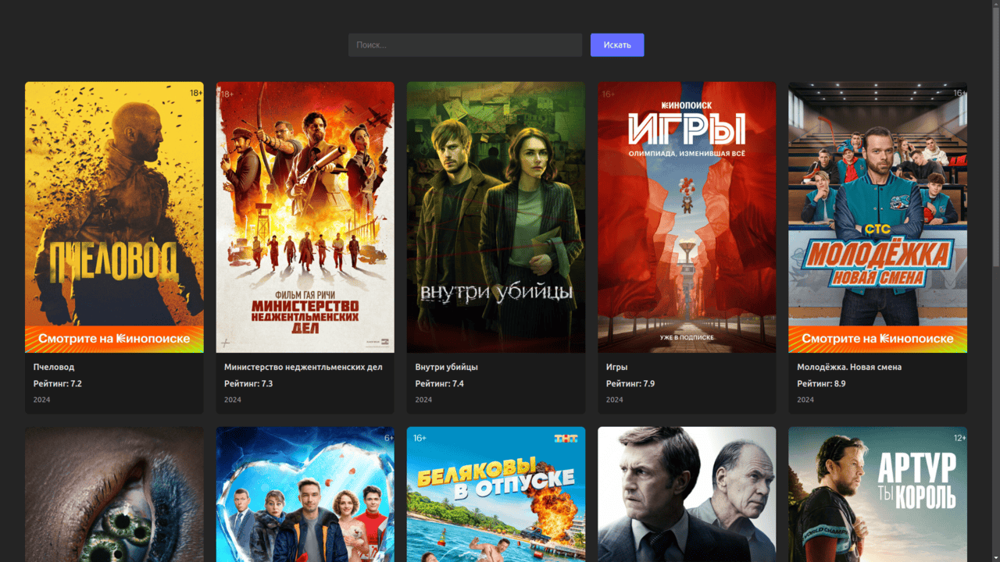
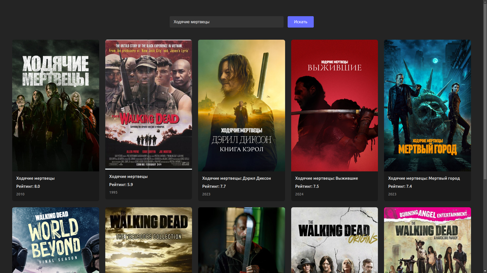

# React Kinopoisk App

## Скриншоты


_Главная страница до ввода поискового запроса_


_Главная страница с результатами поиска по запросу "Ходячие мертвецы"_

## Описание


Это простое React-приложение, которое использует публичный API Кинопоиска для отображения списка популярных **кинопроектов** (фильмы, сериалы, аниме, мультфильмы и т.д.) за текущий год. Приложение позволяет просматривать основную информацию о тайтлах: название, год выпуска, рейтинг и постер. Поиск осуществляется прямо на главной странице. При нажатии на карточку происходит перенаправление на страницу тайтла на сайте Кинопоиска.
## Используемые технологии

*   **React** - JavaScript-библиотека для создания пользовательских интерфейсов.
*   **Vite** - инструмент для быстрой сборки фронтенд-проектов.
*   **Kinopoisk API** - неофициальное публичное API Кинопоиска.
*   **React Router** - библиотека для управления маршрутизацией в приложении.

## Установка и запуск

**Перед запуском необходимо получить API-ключ Кинопоиска и настроить переменные окружения.**

**1. Получение API-ключа:**

*   Перейдите на сайт [kinopoisk.dev](https://kinopoisk.dev/).
*   Нажмите на кнопку "Получить доступ к API", после чего вы будете перенаправлены на Telegram-бота сервиса.
*   Либо перейдите напрямую в Telegram-бот по ссылке: [https://t.me/kinopoiskdev_bot](https://t.me/kinopoiskdev_bot).
*   Следуйте инструкциям бота, чтобы получить ваш персональный API-ключ.

**2. Настройка переменных окружения:**

*   Создайте файл `.env` в корне проекта (в той же папке, где находится `package.json`).
*   Добавьте в файл `.env` строку с вашим API-ключом, используя следующий формат:

    ```
    VITE_KINOPOISK_API_KEY=ваш_API_ключ
    ```

    Замените `ваш_API_ключ` на ключ, полученный на предыдущем шаге.

**3. Клонирование репозитория:**

```bash
git clone https://github.com/bugweaver/react-kinopoisk-app.git
```

**4. Переход в директорию проекта:**

```bash
cd react-kinopoisk-app
```

**5. Установка зависимостей:**

```bash
npm install
```

**6. Запуск приложения:**

```bash
npm run dev
```

Приложение будет доступно по адресу `http://localhost:5173/`.

## Лицензия

Этот проект распространяется под лицензией MIT. Подробнее смотрите в файле [LICENSE](LICENSE).
